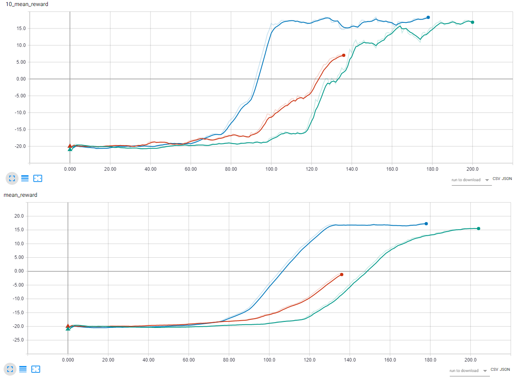

# DQN，Double Q-learning，Deuling Networks，Multi-step learning和Noisy Nets在 Pong 的应用

本周将 Deep Q-Networks (DQN) 应用到 [Pong](https://gym.openai.com/envs/Pong-v0/).


我大部分按照 [Mnih et al.](https://storage.googleapis.com/deepmind-media/dqn/DQNNaturePaper.pdf) 进行 DQN 实现和超参数选取。（最后一页有个表格汇总所有超参数。）

为了使项目更有趣，我改进了基本DQN, 实现了一些变型，如 **Double Q-learning**, **Dueling networks**, **Multi-step learning** and **Noisy Nets**。可以在[Hessel et al.](https://arxiv.org/pdf/1710.02298.pdf) 找到他们。

### [学习理论](../README.md)

---

### Double Q-learning - [论文](https://arxiv.org/pdf/1509.06461.pdf)

使传统 Q-learning 的过高估计偏差最小化。


为使用它，在 *main.py* 进行如下设置：
```python
DQN_HYPERPARAMS = {
    'double_DQN': True,
    ...
}
```

---

### 竞争网络结构(Dueling networks) - [论文](http://proceedings.mlr.press/v48/wangf16.pdf)

它使用2个不同的神经网络：一个输出状态值(the value of the state)，另一个输出每个动作的优势(the advantage of each action)。 
这2个网络共享卷积编码器(convolutional encoder)。


为使用它，在 *main.py* 进行如下设置：
```python
DQN_HYPERPARAMS = {
    'dueling': True,
    ...
}
```

---

### 嘈杂网络(NoisyNet) - [论文](https://arxiv.org/pdf/1706.10295.pdf)

为克服ε-greedy limitations，引入噪声线性层(noise linear layers)。网络会管理噪声流(noise stream)，平衡 The network will manage the noise stream to balance the exploration.


为使用它，在*main.py*进行如下设置：
```python
DQN_HYPERPARAMS = {
    'noisy_net': True,
    ...
}
```

---

### Multi-step

Introduce a forward-view multi-step. Similar to TD(λ)


To use it, in *main.py*, set
```python
DQN_HYPERPARAMS = {
    'n_multi_step': 2, # or 3
    ...
}
```

NB: 从今天开始，因为我们需要训练深度神经网络，我建议在 GPUs 上运行代码。如果你没有，你可以使用[Google Colab](https://colab.research.google.com/)。
同时，为了跟踪网络结果，我们会使用 [TensorboardX](https://github.com/lanpa/tensorboardX) (tensorboard for PyTorch)。当你在个人电脑使用 Google Colab 运行 TensorBoard 时，执行下面部分的命令。

NB: 如果你使用GPUs，记得修改 *main.py* 中的 DEVICE ，从 “cpu” 改成 “cuda” 。


## 为使代码更清晰，分成6个文件:
 - **main.py** 包含程序主体。它创建代理，环境，并操作游戏。每一股，更新代理。
 - **agents.py** 包含代理类，负责管理核心控制，重复操作缓冲和基本功能。
 - **central_control.py** 包含核心控制类，负责初始化DQN（包括它的变型），优化，计算损失等。
 - **buffers.py** 包含类，保存代理记忆的双端序列，并从中采样。
 - **neural_net.py** 包含DQN等代理的深度神经网络。
 - **atari_wrappers.py** 包含atari封装。https://github.com/openai/baselines/blob/master/baselines/common/atari_wrappers.py
 - **utils.py**, 当前包含测试方程。


## 结果

下图展示了不同 DQN 变型在最后10次和40次的游戏中的奖励均值。
X 轴是游戏数量。你可以看到，只有到120次，才能很好地完成游戏学习



-  `Basic DQN`
-  `2-step DQN`
-  `2-step Dueling DQN`

上图有些特别的是：2-step Dueling DQN 比 2-step DQN 表现差。但要注意的是 NNs 有随机性，而且我只测试了一个游戏。DuelingDQN 的论文作者，展示了在其他游戏上更好的结果。

## 安装

```
!pip install gym
!pip install torch torchvision
!pip install tensorboardX
!apt-get install -y python-numpy python-dev cmake zlib1g-dev libjpeg-dev xvfb ffmpeg xorg-dev python-opengl libboost-all-dev libsdl2-dev swig
```

安装 gym
```
!git clone https://github.com/openai/gym.git
import os
os.chdir('gym')
!ls
!pip install -e .
os.chdir('..')
```

Install gym
```
!pip install gym[atari]
```


## 在 Google Colab 运行 TensorBoard

说明来自 https://www.dlology.com/blog/quick-guide-to-run-tensorboard-in-google-colab/

下载和安装 ngrok
```
!wget https://bin.equinox.io/c/4VmDzA7iaHb/ngrok-stable-linux-amd64.zip
!unzip ngrok-stable-linux-amd64.zip
```

运行 ngrok 和 tensorboard
```
LOG_DIR = 'content/runs'

get_ipython().system_raw(
    'tensorboard --logdir {} --host 0.0.0.0 --port 6006 &'.format(LOG_DIR)
)

get_ipython().system_raw('./ngrok http 6006 &')

!curl -s http://localhost:4040/api/tunnels | python3 -c \
    "import sys, json; print(json.load(sys.stdin)['tunnels'][0]['public_url'])"
```
